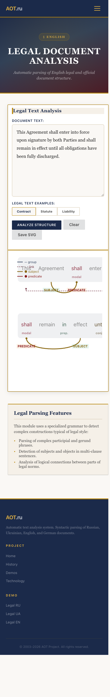
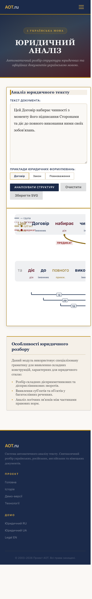

# RML — Russian Morphological Dictionary

> **RML** (Russian Morphological Library) — a linguistic environment for processing Russian, English, German, and Ukrainian texts. Includes morphological analyzers, syntactic parsers, and semantic analysis tools.

## 📖 Table of Contents

- [About](#about)
- [Features](#features)
- [License](#license)
- [Authors](#authors)
- [Prerequisites](#prerequisites)
- [Quick Start](#quick-start)
- [Detailed Build Instructions](#detailed-build-instructions)
  - [Linux](#linux)
  - [macOS](#macos)
  - [Windows](#windows)
- [Running the Daemons](#running-the-daemons)
- [API Reference](#api-reference)
- [Documentation](#documentation)
- [Project Structure](#project-structure)
- [Contributing](#contributing)
- [Support](#support)

---

## About

RML is a comprehensive linguistic processing framework developed for natural language processing (NLP) tasks in Russian, English, German, and Ukrainian. The project started in Moscow at Dialing Company and was later extended with German support at the Berlin-Brandenburg Academy of Sciences and Humanities (DWDS project).

**Official website:** [www.aot.ru](http://www.aot.ru) (Russian)

**Repository:** https://github.com/bivex/aot

---

## Features

- **Morphological analysis** — lemmatization, part-of-speech tagging, inflection patterns
- **Syntactic parsing** — dependency and constituency parsing (Russian, German, English)
- **Semantic analysis** — semantic graph construction, Russian→English translation
- **N-gram statistics** — collocation detection with bigram frequencies
- **HTTP daemons** — REST-like API for integration into other applications
- **Web Interface** — Visual demos for morphological and syntactic analysis
- **Cross-platform** — Linux, macOS, Windows (via CMake)

---

## 🚀 Web Interface & Demos

The project includes a web-based interface for visualizing linguistic analysis:

- **Unified Interface**: `modern/index.html` — A modern SPA for general morphology and syntax.
- **English Legal Demo**: `demo/eng_legal.html` — Optimized for complex contract analysis with original casing preservation.
- **Ukrainian Legal Demo**: `demo/ukr_legal.html` — Specialized for Ukrainian legal documents.




To run the demos locally, see the [Web Interface Guide](Docs/web_interface.md).

---

## License

This project is distributed under the **GNU Lesser General Public License (LGPL)**. See the file `COPYING` for details.

---

## Authors

- Alexey Sokirko ( original author, maintainer upstream )
- Igor Nozhov
- Lev Gershenzon
- Andrey Putrin
- And many other contributors

---

## Prerequisites

### Common for all platforms

- **CMake** ≥ 3.24
- **C++ compiler** with C++17 support:
  - Linux/macOS: g++ ≥ 9.0 or clang ≥ 10
  - Windows: Microsoft Visual Studio ≥ 2019 (MSVC)
- **zlib** development libraries
- **flex** and **bison** ( for building Synan and Seman components )
- **libevent** ( for HTTP daemons )

### Platform-specific notes

#### Linux ( Debian / Ubuntu )
```bash
sudo apt-get install build-essential cmake zlib1g-dev flex bison libevent-dev
```

#### macOS
```bash
brew install cmake zlib flex bison libevent
```

#### Windows
- Install Visual Studio 2019 or newer with C++ Desktop Development workload
- Install Cygwin or use `win_flex_bison` from SourceForge
- See [Windows section](#windows) for details

---

## Quick Start

### 1. Clone the repository ( with submodules )

```bash
git clone --recursive https://github.com/bivex/aot.git RML
cd RML
```

If you already cloned it, initialize submodules:

```bash
git submodule update --init --recursive
```

### 2. Set environment variable

```bash
# Linux / macOS
export RML=/full/path/to/RML

# Windows PowerShell
$env:RML = "C:\path\to\RML"
```

Add this to your shell profile ( `~/.zshrc`, `~/.bashrc`, etc. ) to make it permanent.

### 3. Configure and build

```bash
cd $RML
mkdir build && cd build

# Linux / macOS
cmake .. -DCMAKE_BUILD_TYPE=Release

# Windows ( Visual Studio 2019, 64-bit )
cmake .. -A x64

# Build
make -j$(nproc)    # Linux
make -j$(sysctl -n hw.ncpu)   # macOS
cmake --build . --config Release   # Windows ( or just start Visual Studio )
```

### 4. Install binaries ( optional )

Binaries are built in `build/Source/...`. Copy the ones you need to `$RML/Bin/`:

```bash
# HTTP daemons
cp Source/www/SynanDaemon/SynanDaemon $RML/Bin/
cp Source/www/SemanDaemon/SemanDaemon $RML/Bin/

# Command-line utilities
cp Source/morph_dict/morph_gen/morph_gen $RML/Bin/
cp Source/dicts/StructDictLoader/StructDictLoader $RML/Bin/
```

### 5. Generate bigram index ( required for SynanDaemon )

```bash
# Build bigrams from corpus texts
$RML/build/Source/dicts/Bigrams/Text2Bigrams/Text2Bigrams \
  --language Russian \
  --input-file-list <(find $RML/Texts -name "*.txt") \
  --output-folder $RML/Dicts/Bigrams \
  --window-size 1 \
  --max-memory 500000

# Build index
$RML/build/Source/dicts/Bigrams/BigramsIndex/BigramsIndex $RML/Dicts/Bigrams/
```

### 6. Start the daemons

```bash
# In two separate terminals, or use nohup / screen / tmux

# Terminal 1: SemanDaemon ( semantic analyzer, port 8081 )
RML=$RML ./Bin/SemanDaemon --host 127.0.0.1 --port 8081

# Terminal 2: SynanDaemon ( syntactic analyzer, port 8082 )
RML=$RML ./Bin/SynanDaemon --host 127.0.0.1 --port 8082
```

---

## Detailed Build Instructions

### Linux

**Dependencies ( Debian / Ubuntu ):**
```bash
sudo apt-get update
sudo apt-get install -y build-essential cmake git \
    zlib1g-dev flex bison libevent-dev
```

**Build steps** — same as Quick Start.

**Note:** On some distributions you may need to explicitly set `CXX` and `CC`:
```bash
export CXX=/usr/bin/g++
export CC=/usr/bin/gcc
```

### macOS

**Dependencies ( via Homebrew ):**
```bash
brew install cmake zlib flex bison libevent
```

**Important:** The system's `flex` and `bison` are too old. Homebrew versions are required:
```bash
export FLEX_TOOL=/opt/homebrew/opt/flex/bin/flex
export BISON_TOOL=/opt/homebrew/opt/bison/bin/bison
```

Add these to `~/.zshrc` or `~/.bash_profile`.

**Build steps** — same as Quick Start.

**Known issues:**
- Tests in some submodules fail on macOS due to `char32_t` locale limitations. They are automatically disabled via CMake conditionals.
- The build uses Homebrew's FlexLexer.h to match the flex binary version.

Full macOS-specific guide: [BUILD_MACOS.md](BUILD_MACOS.md)

### Windows

#### Option A: Visual Studio ( recommended )

1. Install **Visual Studio 2019** or **2022** with:
   - Desktop development with C++
   - CMake tools for Windows

2. Open the folder `RML` in Visual Studio ( File → Open → Folder ).

3. Visual Studio will auto-configure and build. You can also use the CMake menu:
   - Build → Build All ( or press F7 )
   - Build → Install ( to copy to `RML\Bin` )

4. To build HTTP daemons, install libevent:
   - Download from https://github.com/libevent/libevent/releases
   - Extract to `RML\Source\contrib\libevent`
   - Build with CMake or use vcpkg: `vcpkg install libevent`

#### Option B: Command line ( MSVC )

```cmd
cd RML
mkdir build
cd build
cmake .. -G "Visual Studio 17 2022" -A x64
cmake --build . --config Release
cmake --install . --config Release --prefix %RML%
```

#### Option C: MinGW / Cygwin

- Install Cygwin with: `gcc-g++`, `cmake`, `flex`, `bison`, `wget`, `gzip`
- Download `win_flex_bison` from SourceForge and place in `RML\external\winflex`
- Follow Linux-like build steps

**Note:** Russian locale must be enabled in Windows Regional Settings to run GUI tools ( MorphWizard, Rossdev ).

---

## Running the Daemons

After building and copying binaries to `$RML/Bin/`:

### SemanDaemon ( port 8081 )

Semantic analyzer and Russian→English translator.

```bash
RML=$RML ./Bin/SemanDaemon --host 127.0.0.1 --port 8081
```

**API endpoints:**

| Action | Parameters | Description |
|--------|-----------|-------------|
| `translate` | `langua=Russian`, `query=<text>`, `topic=<domain>` | Translate Russian text to English |
| `graph` | `langua=Russian`, `query=<text>`, `topic=<domain>` | Build semantic graph ( nodes + edges ) |

**Example:**
```bash
curl -G --data-urlencode "action=translate" \
     --data-urlencode "langua=Russian" \
     --data-urlencode "query=Мама мыла раму" \
     --data-urlencode "topic=common" \
     http://127.0.0.1:8081/
```

### SynanDaemon ( port 8082 )

Syntactic and morphological analyzer.

```bash
RML=$RML ./Bin/SynanDaemon --host 127.0.0.1 --port 8082
```

**API endpoints:**

| Action | Parameters | Description |
|--------|-----------|-------------|
| `morph` | `langua=<Russian\|German\|English>`, `query=<word>` | Morphological analysis of a word |
| `syntax` | `langua=<Russian\|German\|English>`, `query=<sentence>` | Syntactic parsing of a sentence |
| `bigrams` | `langua=Russian`, `query=<word>`, `minBigramsFreq=<N>`, `sortMode=<freq\|mi>` | Find collocations |

**Example:**
```bash
curl -G --data-urlencode "action=morph" \
     --data-urlencode "langua=Russian" \
     --data-urlencode "query=машина" \
     http://127.0.0.1:8082/
```

Both daemons return **JSON** responses.

---

## API Reference

Detailed API documentation is available in the source code:
- `Source/www/SynanDaemon/SynanDmn.cpp` — SynanDaemon actions
- `Source/www/
 lic
Both daemons use `libevent` HTTP server and expect GET requests with query parameters:
- `action` — what to do ( required )
- `langua` — language code ( required )
- `query` — input text ( required )
- Additional action-specific parameters

All responses are in JSON with `Content-Type: application/json; charset=utf8`.

CORS header `Access-Control-Allow-Origin: *` is set for all responses.

---

## Documentation

- **Supported Syntactic Relations:** `Docs/syntactic_relations.md`
- **English Language Resources:** `Docs/english_resources.md`
- **Morphology dictionary documentation:** `Docs/Morph_UNIX.txt`
- **Morph_dict submodule README:** `Source/morph_dict/README.md`
- **Build instructions for macOS:** `BUILD_MACOS.md`
- **In-source comments:** Doxygen-style comments in header files

### Generating documentation with Doxygen

```bash
# Install doxygen
sudo apt-get install doxygen   # Linux
brew install doxygen           # macOS

# Generate
cd $RML/Docs
doxygen Doxyfile
# Open html/index.html in browser
```

---

## Project Structure

```
RML/
├── Bin/                    # Pre-built binaries and data
│   ├── SemanDaemon         # Semantic analyzer daemon
│   ├── SynanDaemon         # Syntactic analyzer daemon
│   ├── Lib/                # Tcl/Tk libraries ( Windows )
│   └── *.txt, *.base       # Dictionary data files
├── build/                  # CMake build directory ( created during build )
├── Dicts/                  # Dictionary data ( generated during build )
│   ├── Morph/              # Morphological dictionaries
│   │   ├── Russian/        # 25 MB  | 298k lemmas | 4.2M word forms
│   │   ├── Ukrainian/      # 25 MB  | 419k lemmas | 4.0M word forms
│   │   ├── English/        # 94 MB  | 445k lemmas | ~2.5M word forms
│   │   └── German/         # 12 MB  | 219k lemmas | 1.5M word forms (no frequency corpus)
│   ├── Bigrams/            # Bigram statistics
│   ├── Ross/               # Thesaurus
│   ├── Aoss/               # Semantic dictionary
│   ├── Collocs/            # Collocations
│   └── GerSynan/           # German grammar tables
├── Source/                 # Source code
│   ├── morph_dict/         # Morphological dictionary library ( git submodule )
│   │   └── data/
│   │       ├── Russian/    # Source: morphs.json (33 MB, 2,767 models)
│   │       ├── Ukrainian/  # Source: morphs.json (39 MB, 5,855 models)
│   │       ├── English/    # Source: morphs.json (28 MB, 2,639 models)
│   │       └── German/     # Source: morphs.json (21 MB, 1,319 models)
│   ├── dicts/              # Dictionary processing tools
│   ├── graphan/            # Graphematical analysis
│   ├── morphen/            # Morphological analysis
│   ├── synan/              # Syntactic analysis
│   ├── seman/              # Semantic analysis
│   ├── common/             # Common utilities
│   └── www/                # HTTP daemons
├── Scripts/                # Utility scripts
│   └── dict_rebuild/       # Dictionary rebuild scripts (see below)
├── Docs/                   # Additional documentation
├── Texts/                  # Sample texts for training ( bigrams )
├── COPYING                 # LGPL license
├── README.md              # This file
└── BUILD_MACOS.md         # macOS build guide ( if you're on macOS )
```

## Rebuilding Dictionaries

### Quick Stats (Binary Output)

| Language | Total Size | Lemmas | Word Forms | WordData Entries | Status |
|----------|-----------|--------|------------|------------------|--------|
| Russian  | 25 MB     | 298,510 | 4.2M      | 51,084           | ✅ rebuilt (May 14) |
| Ukrainian| 25 MB     | 418,983 | 4.0M      | 418,983          | ✅ rebuilt (May 14) |
| English  | 94 MB     | 444,755 | ~2.5M     | 13,933           | ✅ up-to-date |
| German   | 12 MB     | 218,950 | 1.5M      | 0 (empty)        | ✅ rebuilt (May 14) |

**Source data** (in `Source/morph_dict/data/<Language>/`):
- `morphs.json` — morphological models + lemmas (20–40 MB per language)
  - Russian: 2,767 models → 298,510 lemmas → 4.2M word forms (33 MB file)
  - Ukrainian: 5,855 models → 418,983 lemmas → 4.0M word forms (38 MB)
  - English: 2,639 models → 444,755 lemmas → ~2.5M word forms (27 MB)
  - German: 1,319 models → 218,950 lemmas → 1.5M word forms (21 MB)
- `gramtab.json` — grammatical codes (20–174 KB)
- `WordData.txt` — words with frequency corpus (Ukrainian richest: 418k; German empty)

**Binary output** (in `Dicts/Morph/<Language>/`):
- `morph.bases` — lemmas base (2–5 MB): RU 2.6M, UA 4.0M, EN 4.8M, DE 2.8M
- `morph.annot` — annotations (3–6 MB): RU 4.7M, UA 5.6M, EN 4.9M, DE 3.6M
- `morph.forms_autom` — morphological automaton (4–9 MB): RU 6.4M, UA 7.0M, EN 4.0M, DE 4.9M
- `npredict.bin` — unknown word predictor (0.8–3.4 MB)
- `*wordweight.bin` & `*homoweight.bin` — frequency tables (German files are minimal/empty — expected due to empty WordData.txt)

**German-specific notes:**
- Has **no frequency corpus** — `WordData.txt` is empty (0 bytes, rebuilt May 14, 2026)
- Frequency binary files (`*wordweight.bin`) are therefore minimal (60–200 bytes each) — **this is expected and normal**
- Syntactic support provided separately via `Dicts/GerSynan/` (German grammar tables for Synan parser)
- Morphological coverage: ~219k lemmas, ~1.5M word forms — adequate for general text but less comprehensive than Russian/Ukrainian
- Best for: morphological analysis, lemmatization, basic syntactic parsing
- Not suitable for: frequency-based ranking, collocation extraction, corpus linguistics requiring frequency data

### Rebuild Scripts

The project includes automated rebuild scripts for all supported languages:

```bash
cd Scripts/dict_rebuild

# Rebuild specific language
./rebuild_russian_dicts.sh      # Russian
./rebuild_ukrainian_dicts.sh    # Ukrainian
./rebuild_english_dicts.sh      # English
./rebuild_german_dicts.sh       # German

# Verify integrity
./verify_russian_dicts.sh
./verify_ukrainian_dicts.sh

# Full cycle with API test
./rebuild_and_test.sh              # Russian
./rebuild_and_test_ukrainian.sh    # Ukrainian

# Rebuild all at once
./rebuild_all_dicts.sh
```

**Script options:**
- `--clean` — clean build directory first
- `--skip-build` — skip building `morph_gen`, only regenerate dictionaries
- `-h, --help` — show usage

**Workflow:**
1. Edit source files in `Source/morph_dict/data/<Language>/` (e.g., add words to `WordData.txt`)
2. Run rebuild: `./Scripts/dict_rebuild/rebuild_<lang>_dicts.sh --skip-build`
3. Verify: `./Scripts/dict_rebuild/verify_<lang>_dicts.sh`
4. Restart daemons if they are running

**Prerequisites for rebuilding:**
- CMake ≥ 3.24, C++17 compiler, Flex, Bison, zlib
- On macOS: `brew install cmake zlib flex bison libevent` and set `FLEX_TOOL`/`BISON_TOOL`

See `Scripts/dict_rebuild/README.md` for complete documentation.

---

## Contributing

Contributions are welcome! Please:

1. Fork the repository
2. Create a feature branch (`git checkout -b feature/my-feature`)
3. Make changes and test thoroughly
4. Commit with clear messages
5. Push and open a Pull Request

**Areas where help is appreciated:**
- macOS and Windows CI/CD
- Python bindings ( see `morphan/lemmatizer_python/` )
- Bug reports and fixes
- Documentation improvements
- Dockerization

---

## Support

- **Issues:** https://github.com/bivex/aot/issues
- ** Russian community:** www.aot.ru ( forum )
- **Email:** aot@aot.ru ( project maintainers )

For build issues, please include:
- OS and version
- Compiler version (`g++ --version` or `clang --version`)
- CMake version (`cmake --version`)
- Full error log from `build.log`

---

## History

The project originated in the 1990s as a research effort in computational linguistics. Key milestones:

- **1990s:** Initial Russian morphological dictionary created at Dialing Company
- **2000s:** Syntactic module ( Synan ) added
- **2010s:** Semantic module ( Seman ) and English/German extensions
- **2020s:** Open-sourced, CMake build system added, macOS support

---

## Related Projects

- [morph_dict](https://github.com/sokirko74/morph_dict) — core morphological dictionary submodule
- [winflexbison](https://github.com/lexxmark/winflexbison) — Flex/Bison for Windows
- [libevent](https://github.com/libevent/libevent) — event notification library used by daemons

---

**Last updated:** May 2026 ( macOS 15, Apple Silicon tested )
